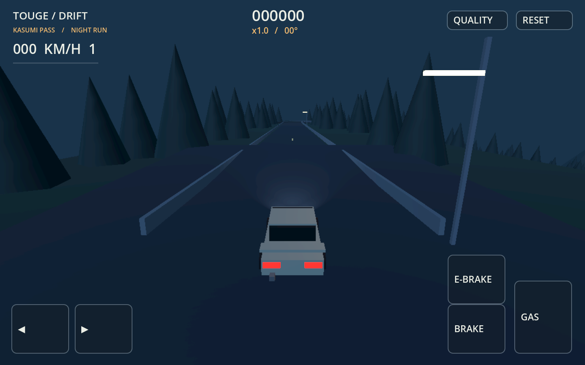

# Touge Drift

An original Android-first assisted drifting prototype. Godot **4.5.1**, GDScript,
Mobile renderer. Landscape, ARM64, Android 7+ (API 24), target API 35.

**Status: v0.1 prototype candidate. Android playability and Pad 7 60 FPS are not
verified.** This is a procedural greybox with a first night presentation pass,
not the finished visual target or the full open-world roadmap.

## Run
Open `project.godot` in Godot 4.5.1 and press F6 on `scenes/world.tscn`, or F5.
The game launches directly into Kasumi Pass, a 1.65 km descent with six hairpins,
a covered tunnel gallery and a small sakura cluster. The car is a fictional
R14 coupe built from original procedural geometry.

Touch: left/right, GAS, BRAKE (reverse after stopping), E-BRAKE. Several fingers
can be held together. Desktop: WASD/arrows, Space handbrake, R restart.
Reset starts a new run; falling respawns at the last road checkpoint. Quality
switches between 75% / 48 smoke particles and 60% / 24 particles.

Brake or tap the handbrake while steering above 29 km/h, then release and use
throttle plus steering to sustain the slide. Drift scoring needs >25 km/h,
12–70° angle and ground contact. Longer drifts increase combo; transitions have
1.4 seconds grace. Recovery banks the combo, wall contact loses it.

## Source
- `scripts/car.gd`: custom CharacterBody3D controller, automatic gear display,
  original coupe, headlights/brake lights and smoke.
- `scripts/drift_assist.gd`: separately tunable assistance Resource.
- `scripts/chase_camera.gd`: velocity/body blended follow and obstacle ray.
- `scripts/hud.gd`: independently tracked multitouch and keyboard fallback.
- `scripts/track.gd`: deterministic road, collision, terrain and batched scenery.
- `scripts/world.gd`: lighting, run progress, checkpoints and quality switch.
- [Game plan](docs/GAME_PLAN.md), [development notes](docs/DEVELOPMENT.md),
  [verification](docs/VERIFICATION.md).

## Test and export
Set `GODOT` to your Godot 4.5.1 executable, then run `tools/test.sh`.
`tools/build_android.sh` exports the debug APK after tests. Configure Java 17,
SDK paths and a local debug keystore in Godot Editor Settings first. Install
matching templates and Android SDK platform-tools, build-tools 35.0.0, platform
35. The project enables Android texture import. See the
[official Godot Android setup](https://docs.godotengine.org/en/4.5/tutorials/export/exporting_for_android.html).

`tools/verify_apk.py builds/touge-drift-v0.1-prototype.apk` checks archive,
resources and ABI. Also run Android `apksigner verify --verbose` and
`aapt2 dump xmltree <apk> --file AndroidManifest.xml`; archive checks alone do
not validate signing or runtime behavior.

`adb install -r builds/touge-drift-v0.1-prototype.apk`

`adb shell am start -n com.harshxda.tougedrift/com.godot.game.GodotApp`

Debug key stays outside the repository. Builds and Godot cache are ignored.
No third-party game assets are used. No city, economy, traffic, police or rivals
are implemented before the handling acceptance gate.
